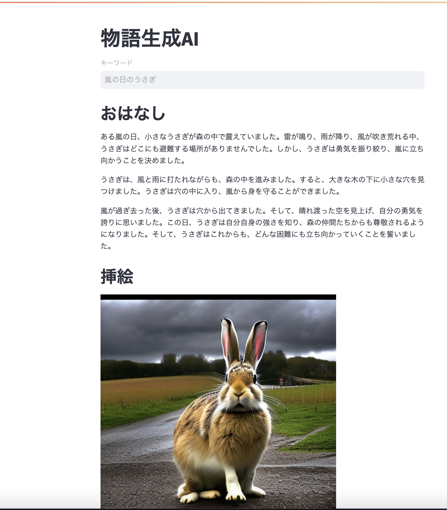

# generate_stories
chatGPTを用いて物語を生成する

## 機能
* UIからキーワードを入力する
* そのキーワードを元にChatGPTで300字以内の物語を作成する
* 同時に、キーワードからDream Studioを用いて挿絵を作成する

## 使用するツール
* ChatGPT4(物語作成と挿絵生成するためのプロンプト作成に使用)
* Dream Studio(画像AI.挿絵生成)
* streamlit(PythonでWebアプリケーションを作成)

## 実行結果
* 生成結果の例

